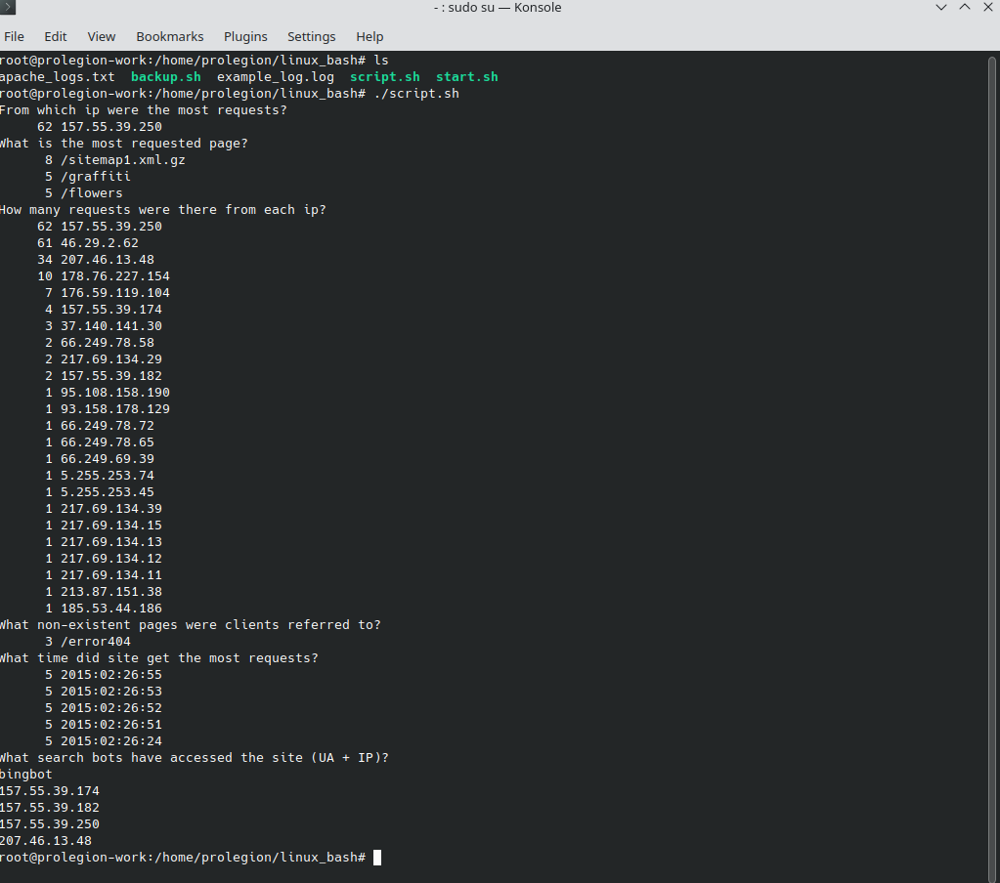
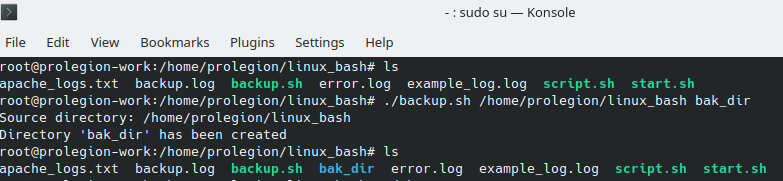
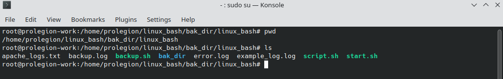
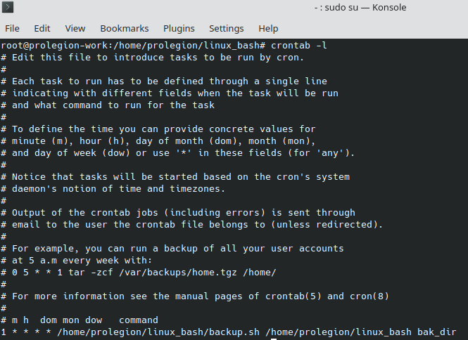

# Linux/Bash
# A. Create a script that uses the following keys:
### 1. When starting without parameters, it will display a list of possible keys and their description.
### 2. The --all key displays the IP addresses and symbolic names of all hosts in the current subnet
### 3. The --target key displays a list of open system TCP ports.
### The code that performs the functionality of each of the subtasks must be placed in a separate function


```Bash
#!/bin/bash
function all {  
                echo Please wait some time
                address=`ip a | grep inet | fgrep -v inet6 | fgrep -v 127.0.0.1 | awk '{print $2}'`
                for i in $address
                do
                        MASK=${i##*/}
                        NETWORK=${i%.*}
                        RESULT=$NETWORK".0/"$MASK
                        nmap -sP -PR $RESULT | awk '{print $5 $6}' | fgrep -v latency | fgrep -v address
                done
}

function target() {
                echo At your machine next ports are opened:
                netstat -lntu | egrep tcp | egrep -v tcp6 | awk '{print $4}' | awk -F ':' '{print $2}'
}

function anything {
                echo You must use options \"--all\" or \"--target\"
}
case $1 in
        --all)  
                all
                ;;
        --target)
                target
                ;;
        *)
                anything
                ;;
esac

```
# B. Using Apache log example create a script to answer the following questions
### 1. From which ip were the most requests?
### 2. What is the most requested page?
### 3. How many requests were there from each ip?
### 4. What non-existent pages were clients referred to?
### 5. What time did site get the most requests?
### 6. What search bots have accessed the site? (UA + IP)


```Bash
#!/bin/bash
echo From which ip were the most requests?
cat apache_logs.txt | awk '{print $1}' | sort | uniq -c | sort -rnk1 | head -1

echo What is the most requested page?
cat apache_logs.txt | awk '{print $7}' | sort | uniq -c | sort -rnk1 | head -3

echo How many requests were there from each ip?
cat apache_logs.txt | awk '{print $1}' | sort | uniq -c | sort -rnk1

echo What non-existent pages were clients referred to?
egrep 'error404' apache_logs.txt | awk '{print $7}' | sort | uniq -c | sort -rnk1

echo What time did site get the most requests?
cat apache_logs.txt | awk '{print $4}' | awk -F '/' '{print $3}' | awk '{print $1}' |  sort | uniq -cd | sort -rnk1 | head -5

echo What search bots have accessed the site \(UA + IP\)?

echo bingbot
cat apache_logs.txt | egrep bingbot | awk '{print $1}' | sort | uniq -d

```
# C. Create a data backup script that takes the following data as parameters
### 1. Path to the syncing directory.
### 2. The path to the directory where the copies of the files will be stored.
### In case of adding new or deleting old files, the script must add a corresponding entry to the log file indicating the time, type of operation and file name. [The command to run the script must be added to crontab with a run frequency of one minute]




```Bash
#!/bin/bash

#OPTIONS

# Check if the input folders exists.
checkFolder() {
    if [ -d "$1" ]; then
        echo "$2 directory: $1"
    elif [[ "$2" = "Destination" && ! -d "$1" ]]; then
            mkdir -p "$1"
            echo "Directory '$1' has been created"
    else
        echo "No such dirrectory: '$1'"
        exit
    fi
}

# Backup data and save results and errors to the log file.
backupFunction() {
    if [[ -f "$3" || -f "$4" ]]; then
        touch "$3" "$4"
    fi
    rsync -a --delete --out-format='%t %o %n' $1 $2 1>>"$3" 2>>"$4"
}    

optionHelp() {
cat <<EOF
Usage: backup [SOURCE DIRECTORY] [DESTINATION DIRECTORY]
    SOURCE DIRECTORY - ex.: /home/
        Full path to the directory backup of which will be created.
    DESTINATION DIRECTIORY - ex.: /backup/
        Full path to the directory to which backup will be saved of SOURCE DIRECTORY.
        If DESTINATION DIRECTORY doesn't exist, script will create this one automatically.
EOF
}

#MAIN

if [[ -z "$1" || -z "$2" ]]; then
    optionHelp
elif [ "$1" = --help ]; then
    optionHelp
else
    SOURCE_DIR="$1"
    checkFolder "$SOURCE_DIR" "Source"

    DEST_DIR="$2"
    checkFolder "$DEST_DIR" "Destination"

    LOG_FILE="backup.log"
    ERR_LOG="error.log"

    backupFunction "$SOURCE_DIR" "$DEST_DIR" "$LOG_FILE" "$ERR_LOG"
fi

```
