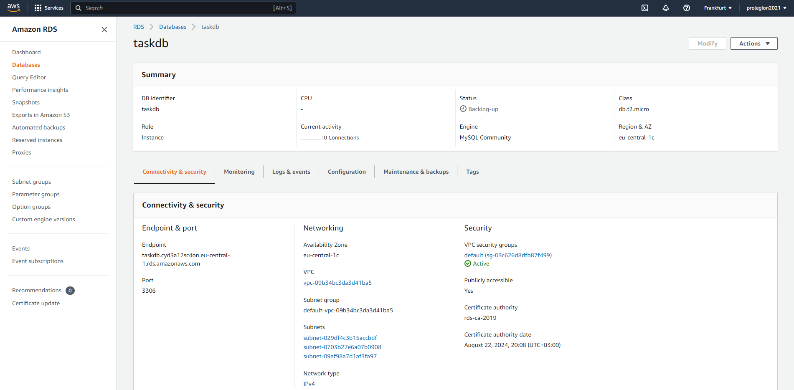

# [TASK 2. Databases. MySQL. MongoDB]
### 1. Download MySQL server for your OS on VM.
```
docker run --name=mysql1 --restart on-failure -d mysql/mysql-server:8.0
Unable to find image 'mysql/mysql-server:8.0' locally
8.0: Pulling from mysql/mysql-server
134439bbc243: Pull complete
24197d57c06a: Pull complete
a8ff14042390: Pull complete
209d472e303b: Pull complete
4158d94acc40: Pull complete
807107bf7d7a: Pull complete
5f5d5a703fe0: Pull complete
Digest: sha256:1b2005199e9dc12d88d5950cd738dfd12172b1224675294646ea9d6031c78408
Status: Downloaded newer image for mysql/mysql-server:8.0
4262afe15b4eed522a0021404ad6d664a64269d792df9d48c314c938660302b3
root@prolegion-work:/home/prolegion/DevOps_Task/2_Databases_Task# docker ps -a
CONTAINER ID   IMAGE                    COMMAND                  CREATED         STATUS                            PORTS                       NAMES
4262afe15b4e   mysql/mysql-server:8.0   "/entrypoint.sh mysq…"   7 seconds ago   Up 6 seconds (health: starting)   3306/tcp, 33060-33061/tcp   mysql1
root@prolegion-work:/home/prolegion/DevOps_Task/2_Databases_Task# docker logs mysql1 2>&1 | grep GENERATED
[Entrypoint] GENERATED ROOT PASSWORD: U&0S@b95UZRYC=,%@D5_2O^thMj2s8v9
root@prolegion-work:/home/prolegion/DevOps_Task/2_Databases_Task# docker exec -it mysql1 mysql -uroot -p
Enter password:
Welcome to the MySQL monitor.  Commands end with ; or \g.
Your MySQL connection id is 11
Server version: 8.0.31

Copyright (c) 2000, 2022, Oracle and/or its affiliates.

Oracle is a registered trademark of Oracle Corporation and/or its
affiliates. Other names may be trademarks of their respective
owners.

Type 'help;' or '\h' for help. Type '\c' to clear the current input statement.

mysql>
```
### 3. Select a subject area and describe the database schema, (minimum 3 tables)
```
mysql> show databases;
+--------------------+
| Database           |
+--------------------+
| information_schema |
| mysql              |
| performance_schema |
| sys                |
+--------------------+
4 rows in set (0.01 sec)

```
### 4. Create a database on the server through the console.
```
mysql> CREATE DATABASE STUDENTS;
Query OK, 1 row affected (0.01 sec)

mysql> show databases;
+--------------------+
| Database           |
+--------------------+
| STUDENTS           |
| information_schema |
| mysql              |
| performance_schema |
| sys                |
+--------------------+
5 rows in set (0.01 sec)

```
### 5. Fill in tables.
```
mysql> use STUDENTS;
Database changed
mysql> create table Students (id INT NOT NULL AUTO_INCREMENT, FirstName MEDIUMTEXT, Secondname MEDIUMTEXT, Description LONGTEXT, Dateofbirthday DATE, Course INT, PRIMARY KEY (id), index (id));
Query OK, 0 rows affected (0.08 sec)

mysql> show tables;
+--------------------+
| Tables_in_STUDENTS |
+--------------------+
| Students           |
+--------------------+
1 row in set (0.00 sec)

mysql> create table Course (id INT NOT NULL AUTO_INCREMENT, Course MEDIUMTEXT, Enrollmentdate DATE, Notice Longtext, PRIMARY KEY (id), index (id));
Query OK, 0 rows affected (0.05 sec)

mysql> create table Tasks (id INT NOT NULL AUTO_INCREMENT, Course INT, Nameoftasks MEDIUMTEXT, Secondname INT, Description Longtext, Reportdate DATE, PRIMARY KEY
    -> (id), index (id));
Query OK, 0 rows affected (0.05 sec)

mysql> show tables;
+--------------------+
| Tables_in_STUDENTS |
+--------------------+
| Course             |
| Students           |
| Tasks              |
+--------------------+
3 rows in set (0.00 sec)

mysql> insert into Course (course, Enrollmentdate, Notice) values ('Devops_2022', '2022-06-28', 'The best course!');
Query OK, 1 row affected (0.04 sec)

mysql> select * from Course;
+----+-------------+----------------+------------------+
| id | Course      | Enrollmentdate | Notice           |
+----+-------------+----------------+------------------+
|  1 | Devops_2022 | 2022-06-28     | The best course! |
+----+-------------+----------------+------------------+
1 row in set (0.00 sec)

mysql> insert into Students (firstname, secondname, dateofbirthday) value ('Anton', 'Antonov', '2000-05-05');
Query OK, 1 row affected (0.01 sec)

mysql> insert into Students (firstname, secondname, dateofbirthday) value ('Ivan', 'Ivanov', '1997-05-11');
Query OK, 1 row affected (0.01 sec)

mysql> update Students, (select id from Course where Course='Devops_2022') as idcourse set Students.Course=idcourse.id where Students.Secondname='Ivanov';
Query OK, 1 row affected (0.04 sec)
Rows matched: 1  Changed: 1  Warnings: 0

mysql> update Students, (select id from Course where Course='Devops_2022') as idcourse set Students.Course=idcourse.id where Students.Secondname='Antonov';
Query OK, 1 row affected (0.04 sec)
Rows matched: 1  Changed: 1  Warnings: 0

mysql> update Students set Description='Nice communication skills' where Secondname='Antonov';
Query OK, 1 row affected (0.01 sec)
Rows matched: 1  Changed: 1  Warnings: 0

mysql> select * from Students;
+----+-----------+------------+---------------------------+----------------+--------+
| id | FirstName | Secondname | Description               | Dateofbirthday | Course |
+----+-----------+------------+---------------------------+----------------+--------+
|  1 | Anton     | Antonov    | Nice communication skills | 2000-05-05     |      1 |
|  2 | Ivan      | Ivanov     | NULL                      | 1997-05-11     |      1 |
+----+-----------+------------+---------------------------+----------------+--------+
2 rows in set (0.00 sec)

mysql> insert into Tasks (course, Nameoftasks, Secondname, ReportDate) values ((select id from Course where Course='Devops_2022'), 'Task_2', (select id from Students where Secondname='Antonov'), NOW());
Query OK, 1 row affected, 1 warning (0.01 sec)

mysql> select * from Tasks;
+----+--------+-------------+------------+-------------+------------+
| id | Course | Nameoftasks | Secondname | Description | Reportdate |
+----+--------+-------------+------------+-------------+------------+
|  1 |      1 | Task_2      |          1 | NULL        | 2022-11-30 |
+----+--------+-------------+------------+-------------+------------+
1 row in set (0.01 sec)

```
### 6. Construct and execute SELECT operator with WHERE, GROUP BY and ORDER BY.
```
mysql> select Course, count(*) as CourseCount from Students GROUP BY Course;
+--------+-------------+
| Course | CourseCount |
+--------+-------------+
|      1 |           2 |
+--------+-------------+
1 row in set (0.00 sec)

mysql> select Course, count(*) as CourseCount from Students GROUP BY Course ORDER BY Course desc;
+--------+-------------+
| Course | CourseCount |
+--------+-------------+
|      1 |           2 |
+--------+-------------+
1 row in set (0.00 sec)

```
### 7. Execute other different SQL queries DDL, DML, DCL.
```
### DDL ###

mysql> create user 'epam_user_0'@'localhost' identified by '1234556';
Query OK, 0 rows affected (0.02 sec)

mysql> alter table Students add column sex text;
Query OK, 0 rows affected (0.04 sec)
Records: 0  Duplicates: 0  Warnings: 0

mysql> show columns from Students;
+----------------+------------+------+-----+---------+----------------+
| Field          | Type       | Null | Key | Default | Extra          |
+----------------+------------+------+-----+---------+----------------+
| id             | int        | NO   | PRI | NULL    | auto_increment |
| FirstName      | mediumtext | YES  |     | NULL    |                |
| Secondname     | mediumtext | YES  |     | NULL    |                |
| Description    | longtext   | YES  |     | NULL    |                |
| Dateofbirthday | date       | YES  |     | NULL    |                |
| Course         | int        | YES  |     | NULL    |                |
| sex            | text       | YES  |     | NULL    |                |
+----------------+------------+------+-----+---------+----------------+
7 rows in set (0.00 sec)

mysql> create table TEST (id INT);
Query OK, 0 rows affected (0.07 sec)

mysql> rename table TEST to EXAMPLE;
Query OK, 0 rows affected (0.02 sec)

mysql> drop table EXAMPLE;
Query OK, 0 rows affected (0.03 sec)

### DML ###

mysql> delete from Students where FirstName='John Doe';
Query OK, 0 rows affected (0.00 sec)


### DCL ###

mysql> grant select on STUDENTS.Students to 'epam_user_0'@'localhost';
Query OK, 0 rows affected, 1 warning (0.01 sec)


```
### 8. Create a database of new users with different privileges. Connect to the database as a new user and verify that the privileges allow or deny certain actions.
```
mysql> create user 'epam_user_1'@'localhost' identified by '1234556';
Query OK, 0 rows affected (0.01 sec)

mysql> grant select on STUDENTS.Students to 'epam_user_1'@'localhost';
Query OK, 0 rows affected, 1 warning (0.01 sec)

root@prolegion-work: docker exec -it mysql1 mysql -uepam_user_1 -p
Enter password:
Welcome to the MySQL monitor.  Commands end with ; or \g.
Your MySQL connection id is 502
Server version: 8.0.31 MySQL Community Server - GPL

Copyright (c) 2000, 2022, Oracle and/or its affiliates.

Oracle is a registered trademark of Oracle Corporation and/or its
affiliates. Other names may be trademarks of their respective
owners.

Type 'help;' or '\h' for help. Type '\c' to clear the current input statement.

mysql> use STUDENTS;
Reading table information for completion of table and column names
You can turn off this feature to get a quicker startup with -A

Database changed

mysql> show tables;
+--------------------+
| Tables_in_STUDENTS |
+--------------------+
| Students           |
+--------------------+
1 row in set (0.01 sec)

mysql> insert into Students (FirstName, SecondName, Description, Dateofbirthday, Course) values ('John', 'Doe', 'Best student', '2000-02-12', 2);
ERROR 1142 (42000): INSERT command denied to user 'epam_user_1'@'localhost' for table 'Students'
mysql> create table NEW;
ERROR 1142 (42000): CREATE command denied to user 'epam_user_1'@'localhost' for table 'NEW'
mysql> select * from Students where Firstname like 'Anton';
+----+-----------+------------+---------------------------+----------------+--------+------+
| id | FirstName | Secondname | Description               | Dateofbirthday | Course | sex  |
+----+-----------+------------+---------------------------+----------------+--------+------+
|  1 | Anton     | Antonov    | Nice communication skills | 2000-05-05     |      1 | NULL |
+----+-----------+------------+---------------------------+----------------+--------+------+
1 row in set (0.00 sec)

```
### 9. Make a selection from the main table DB MySQL.
```
mysql> use mysql;
Reading table information for completion of table and column names
You can turn off this feature to get a quicker startup with -A

Database changed
mysql> show tables;
+------------------------------------------------------+
| Tables_in_mysql                                      |
+------------------------------------------------------+
| columns_priv                                         |
| component                                            |
| db                                                   |
| default_roles                                        |
| engine_cost                                          |
| func                                                 |
| general_log                                          |
| global_grants                                        |
| gtid_executed                                        |
| help_category                                        |
| help_keyword                                         |
| help_relation                                        |
| help_topic                                           |
| innodb_index_stats                                   |
| innodb_table_stats                                   |
| ndb_binlog_index                                     |
| password_history                                     |
| plugin                                               |
| procs_priv                                           |
| proxies_priv                                         |
| replication_asynchronous_connection_failover         |
| replication_asynchronous_connection_failover_managed |
| replication_group_configuration_version              |
| replication_group_member_actions                     |
| role_edges                                           |
| server_cost                                          |
| servers                                              |
| slave_master_info                                    |
| slave_relay_log_info                                 |
| slave_worker_info                                    |
| slow_log                                             |
| tables_priv                                          |
| time_zone                                            |
| time_zone_leap_second                                |
| time_zone_name                                       |
| time_zone_transition                                 |
| time_zone_transition_type                            |
| user                                                 |
+------------------------------------------------------+
38 rows in set (0.00 sec)

```
# TASK PART 2
### 10.Make backup of your database.
```
root@prolegion-work:/home/prolegion/DevOps_Task# docker exec -it mysql1 bash
bash-4.4# mysqldump -u root -p STUDENTS > /tmp/backup.sql
Enter password:
bash-4.4# ls -la /tmp/backup.sql
-rw-r--r-- 1 root root 3766 Nov 30 15:17 /tmp/backup.sql
bash-4.4#

```
### 11.Delete the table and/or part of the data in the table.
```
mysql> use STUDENTS;
Reading table information for completion of table and column names
You can turn off this feature to get a quicker startup with -A

Database changed
mysql> drop table Students;
Query OK, 0 rows affected (0.03 sec)

mysql> show tables;
+--------------------+
| Tables_in_STUDENTS |
+--------------------+
| Course             |
| Tasks              |
+--------------------+
2 rows in set (0.00 sec)

```
### 12.Restore your database.
```
mysql> source /tmp/backup.sql
...
Query OK, 0 rows affected (0.00 sec)

mysql> show tables;
+--------------------+
| Tables_in_STUDENTS |
+--------------------+
| Course             |
| Students           |
| Tasks              |
+--------------------+
3 rows in set (0.00 sec)
```
### 13.Transfer your local database to RDS AWS.
### 14.Connect to your database.


```
bash-4.4# mysql --host taskdb.cyd3a12sc4on.eu-central-1.rds.amazonaws.com -uroot -p
Enter password:
Welcome to the MySQL monitor.  Commands end with ; or \g.
Your MySQL connection id is 21
Server version: 8.0.28 Source distribution

Copyright (c) 2000, 2022, Oracle and/or its affiliates.

Oracle is a registered trademark of Oracle Corporation and/or its
affiliates. Other names may be trademarks of their respective
owners.

Type 'help;' or '\h' for help. Type '\c' to clear the current input statement.

mysql> show databases;
+--------------------+
| Database           |
+--------------------+
| information_schema |
| mysql              |
| performance_schema |
| sys                |
+--------------------+
4 rows in set (0.09 sec)

mysql> CREATE DATABASE STUDENTS;
Query OK, 1 row affected (0.06 sec)

mysql> exit
Bye
bash-4.4# mysql --host taskdb.cyd3a12sc4on.eu-central-1.rds.amazonaws.com -uroot -p STUDENTS < /tmp/backup.sql
Enter password:
bash-4.4# mysql --host taskdb.cyd3a12sc4on.eu-central-1.rds.amazonaws.com -uroot -p
Enter password:
Welcome to the MySQL monitor.  Commands end with ; or \g.
Your MySQL connection id is 23
Server version: 8.0.28 Source distribution

Copyright (c) 2000, 2022, Oracle and/or its affiliates.

Oracle is a registered trademark of Oracle Corporation and/or its
affiliates. Other names may be trademarks of their respective
owners.

Type 'help;' or '\h' for help. Type '\c' to clear the current input statement.

mysql> show databases;
+--------------------+
| Database           |
+--------------------+
| STUDENTS           |
| information_schema |
| mysql              |
| performance_schema |
| sys                |
+--------------------+
5 rows in set (0.12 sec)
```
### 15.Execute SELECT operator similar step 6.
```
mysql> use STUDENTS;
Reading table information for completion of table and column names
You can turn off this feature to get a quicker startup with -A

Database changed
mysql> select * from Students;
+----+-----------+------------+---------------------------+----------------+--------+------+
| id | FirstName | Secondname | Description               | Dateofbirthday | Course | sex  |
+----+-----------+------------+---------------------------+----------------+--------+------+
|  1 | Anton     | Antonov    | Nice communication skills | 2000-05-05     |      1 | NULL |
|  2 | Ivan      | Ivanov     | NULL                      | 1997-05-11     |      1 | NULL |
+----+-----------+------------+---------------------------+----------------+--------+------+
2 rows in set (0.20 sec)

```
### 16.Create the dump of your database.
```
bash-4.4# mysqldump --host taskdb.cyd3a12sc4on.eu-central-1.rds.amazonaws.com -uroot -p STUDENTS > awsbackup.sql
Enter password:
Warning: A partial dump from a server that has GTIDs will by default include the GTIDs of all transactions, even those that changed suppressed parts of the database. If you don't want to restore GTIDs, pass --set-gtid-purged=OFF. To make a complete dump, pass --all-databases --triggers --routines --events.
bash-4.4# ls
awsbackup.sql  boot  docker-entrypoint-initdb.d  etc             home  lib64  mnt  proc  run   srv  tmp  var
bin            dev   entrypoint.sh               healthcheck.sh  lib   media  opt  root  sbin  sys  usr

```
# PART 3 – MongoDB

### 17. Create a database. Use the use command to connect to a new database (If it doesn't exist, Mongo will create it when you write to it).
```
docker exec -it some-mongo mongosh

```
### 18. Create a collection. Use db.createCollection to create a collection. I'll leave the subject up to you. Run show dbs and show collections to view your database and collections.
```
test> db.createCollection('MyCollection');
{ ok: 1 }
test> show dbs;
admin   40.00 KiB
config  12.00 KiB
local   40.00 KiB
test     8.00 KiB
test> show collections;
MyCollection
test>

```
### 19. Create some documents. Insert a couple of documents into your collection. I'll leave the subject matter up to you, perhaps cars or hats.
```
test> db.MyCollection.insertOne({type:'plastic', name:'car',price:'10$'});
{
  acknowledged: true,
  insertedId: ObjectId("638787dc012c0fa95aede252")
}
test> db.MyCollection.insertOne({type:'plastic', name:'mouse',price:'10$'});
{
  acknowledged: true,
  insertedId: ObjectId("63878851012c0fa95aede253")
}
test> db.MyCollection.insertOne({type:'metal', name:'hand',price:'10$'});
{
  acknowledged: true,
  insertedId: ObjectId("63878868012c0fa95aede254")
}
```
### 20. Use find() to list documents out.
```
test> db.MyCollection.find({name:'c
test> show collections;
MyCollection
test> db.MyCollection.find({name:'hand'});
[
  {
    _id: ObjectId("63878868012c0fa95aede254"),
    type: 'metal',
    name: 'hand',
    price: '10$'
  }
]
```
